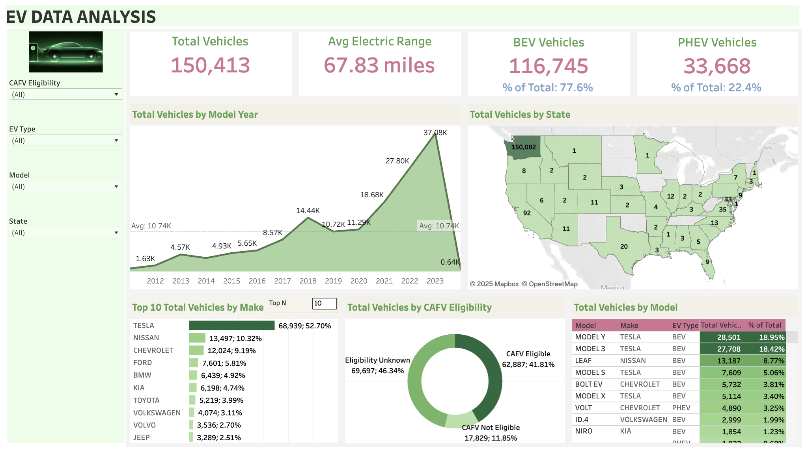

# Electric Vehicle Data Analysis Dashboard

## Project Overview

The automotive industry is undergoing a historic transformation, shifting from internal combustion engines to sustainable electric mobility. This project explores the rapidly evolving landscape of Electric Vehicle (EV) adoption in the United States, providing a data-driven narrative of how technological advancements and government policy have catalyzed market growth.

Through this analysis, I aim to demonstrate the power of business intelligence in decoding complex market trends. By leveraging data preprocessing in Python and interactive visualization in Tableau, this project uncovers actionable insights into consumer behavior, manufacturer dominance, and the critical role of legislative support in the green energy transition.

## Dashboard Screenshot

## Tableau Public Link

[View the Interactive Dashboard](https://public.tableau.com/app/profile/shubham.kulkarni4831/viz/EV_DataAnalysis_17295684020190/EVDATAANALYSIS)

## The Story of EV Adoption

The adoption of electric vehicles has shifted from a niche curiosity to a mainstream movement. A significant driver of this exponential growth has been strategic government intervention. State and federal subsidies, tax credits, and infrastructure investments have effectively lowered the entry barrier for consumers, allowing manufacturers to scale production and innovation.

Our analysis reveals a direct correlation between policy incentives—specifically Clean Alternative Fuel Vehicle (CAFV) eligibility—and the surge in specific model registrations. By reducing the effective cost of ownership, these subsidies have not only boosted sales for established players like Tesla but have also enabled traditional automakers and new entrants to compete aggressively in the market.

## Methodology

This project employs a robust data analysis workflow:

1.  **Data Collection & Cleaning (Python/Excel):** The raw dataset, containing over 150,000 records, was processed to handle missing values, standardize formatting, and derive key metrics.
2.  **Exploratory Data Analysis:** Initial investigation into variables such as Electric Range, Make, Model Year, and Location to understand underlying distributions.
3.  **Visualization & Dashboarding (Tableau):** Creation of an interactive dashboard to visualize temporal trends, geospatial distribution, and categorical breakdowns.

## Key Insights

### Market Dominance and Growth
*   **Exponential Growth:** The data indicates a consistent year-over-year increase in EV registrations, with a sharp acceleration starting in 2015, aligning with major policy shifts and battery technology improvements.
*   **BEV vs. PHEV:** Battery Electric Vehicles (BEVs) constitute the majority (77.6%) of the market compared to Plug-in Hybrid Electric Vehicles (PHEVs) (22.4%), signaling strong consumer confidence in fully electric infrastructure.

### Impact of Subsidies
*   **CAFV Eligibility:** A substantial portion of the registered fleet qualifies for Clean Alternative Fuel Vehicle benefits. This eligibility acts as a primary sales catalyst, as evidenced by the high concentration of eligible models in the top-selling categories.
*   **Manufacturer Performance:** Tesla continues to lead the market, but the data shows a diversifying landscape with increasing market share from manufacturers like Kia, Nissan, and Chevrolet, supported by their eligible model offerings.

### Range Anxiety and Technology
*   **Electric Range Evolution:** While the average electric range across the entire dataset sits at approximately 68 miles (influenced by older models and PHEVs), new BEV registrations show significantly higher range capabilities, effectively addressing historical "range anxiety."

## Conclusion

This analysis highlights how data can bridge the gap between raw numbers and strategic understanding. The transition to electric vehicles is not just a technological shift but a policy-driven economic evolution. By analyzing these trends, we can better understand the future trajectory of the automotive sector and the continued importance of data in shaping a sustainable future.

## Author
Shubham Kulkarni